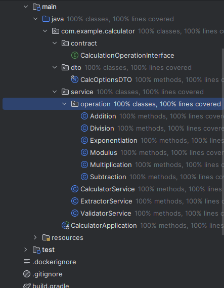

# task

```text
Java Recruitment Task: Mini Calculator
Task: Implement a simple calculator in Java that can perform up to 6 different calculations.
The calculator should support the following operations:
• Addition (a + b)
• Subtraction (a - b)
• Multiplication (a * b)
• Division (a / b) – handle division by zero safely
• Exponentiation (a ^ b)
• Modulus (a % b)
Requirements:
• Implement a class Calculator with a method: public double calculate(double a, double b, String
operator)
• The operator parameter should accept +, -, *, /, ^, %
• Handle invalid operators gracefully (e.g., throw an exception or return an error message)
• Write at least 3 unit tests for your solution
Example:
Calculator calc = new Calculator(); System.out.println(calc.calculate(5, 3, "+"));
// 8.0 System.out.println(calc.calculate(5, 3, "/")); // 1.666...
System.out.println(calc.calculate(5, 3, "^")); // 125.0
```

# java-calculator test coverage.


# java-calculator run.

```shell
git clone https://github.com/Neznajki/java-calculator
cd java-calculator
```
* expected 21
```shell
java -version
```

* windows
```shell
./gradlew.bat build
./gradlew.bat test
./gradlew.bat bootRun --args="10 5 +"
```

* linux
```shell
./gradlew build
./gradlew test
./gradlew bootRun --args="10.2 5 *"
```

* tested on Windows 10
```text
openjdk 21.0.9 2025-10-21 LTS
OpenJDK Runtime Environment Temurin-21.0.9+10 (build 21.0.9+10-LTS)
OpenJDK 64-Bit Server VM Temurin-21.0.9+10 (build 21.0.9+10-LTS, mixed mode, sharing)
```

* done in 3h
```text
there are cases that is not optimal. but I prefer readability and YARGNI.
```